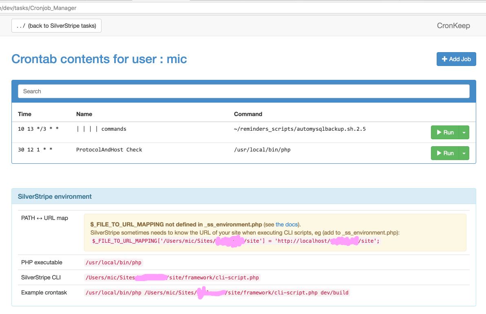
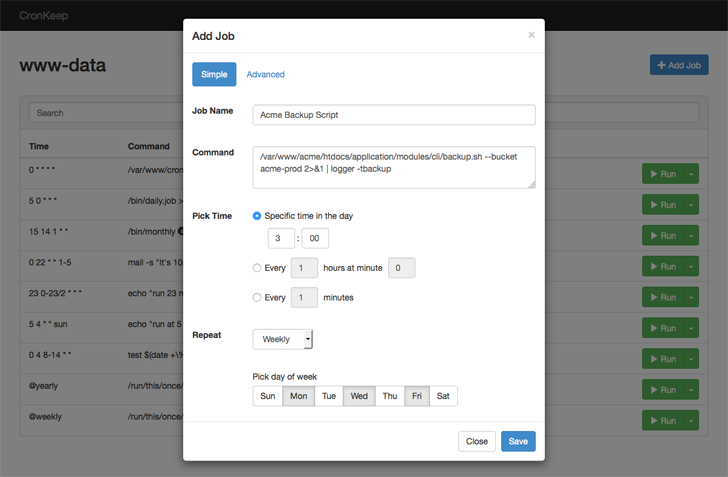

# Manage cronjobs from SilverStripe
This module wraps CronKeep into the Silverstripe framework. It contains an adapted & patched version of the excellent CronKeep tool, making cron-job management available to admins via the SilverWtripe dev-tasks.

## Installation
```
composer require restruct/silverstripe-cronkeep:@stable
```

CronKeep can then be openend (after a ?flush=1) as /dev/tasks/

## SilverStripe CronKeep module - Cronjob management via web interface

CronKeep is a web-based crontab management tool which enables teams to have visibility over what cron jobs are scheduled, run jobs on demand, add new cron jobs in a human-friendly way, or pause a cron schedule from going off, without the need for sysadmin-level access.





## Features

* Run cron jobs on demand
* Add new jobs in a simple way
* Pause a cron job schedule
* Change or delete existing jobs
* Minimal setup required (no database dependency)

## Live Demo

See the app in action at [demo.cronkeep.com](http://demo.cronkeep.com).
Running cron jobs is disabled in the demo app. 

## Note

The current CronKeep version interacts only with the crontab of the user Apache is running as. This means it will only have access to the jobs added for user `www-data`, `apache` or `nobody`, depending on your system.

## License

CronKeep is a free to use application, both for non-profit and commercial organizations, licensed under the terms of Apache License 2.0. Contributions are encouraged.
- - -
[](https://insight.sensiolabs.com/projects/aa1eeb97-0cf2-410c-851c-6deb6e88b032)
